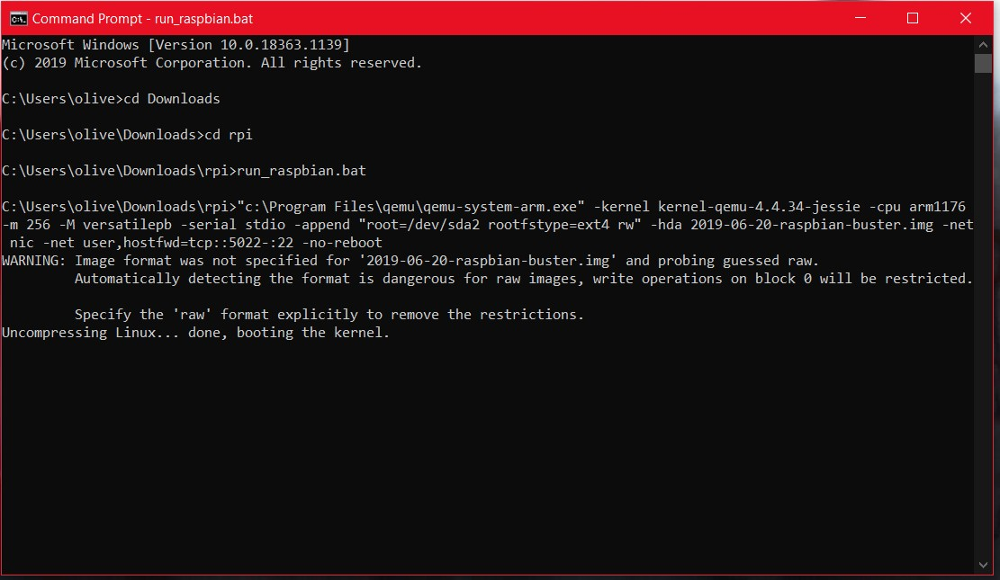
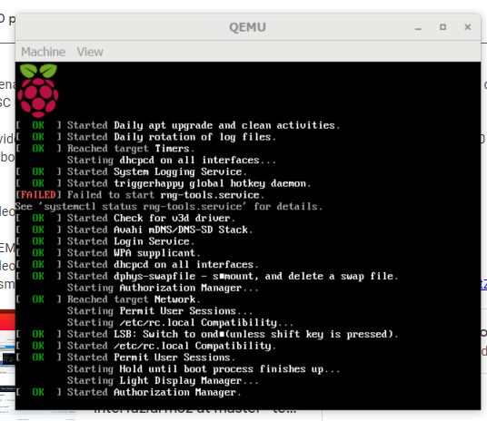
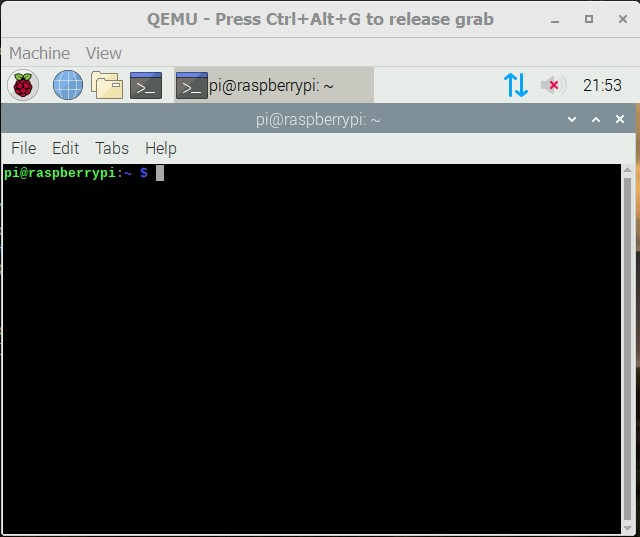
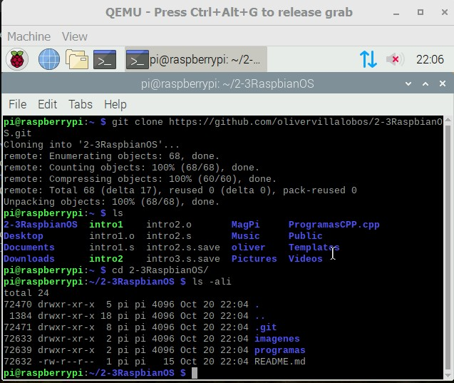
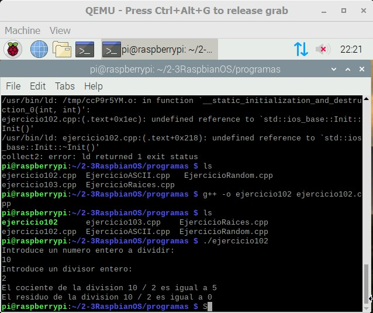
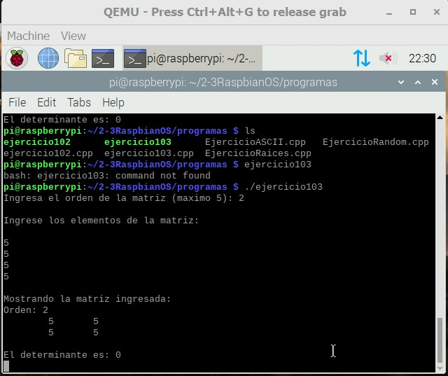
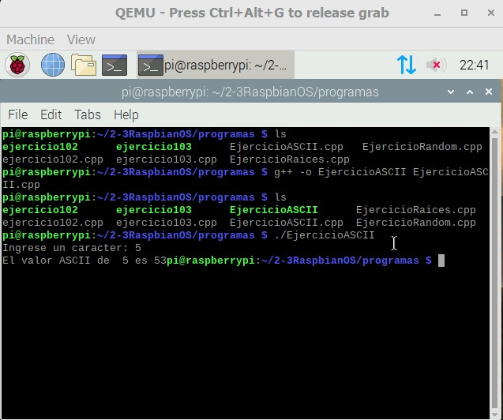
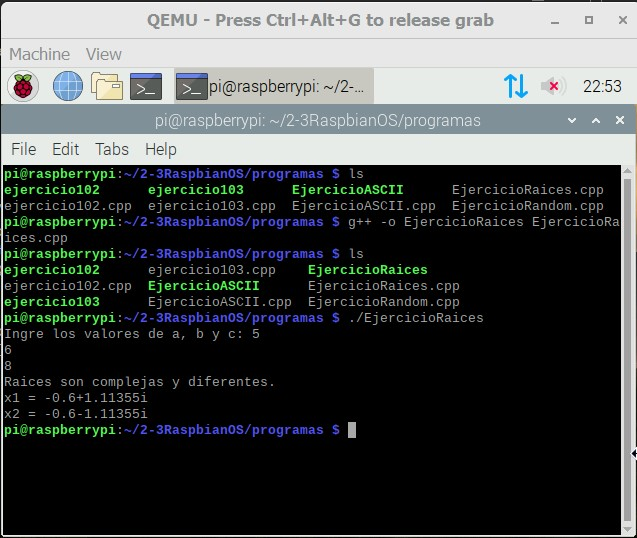
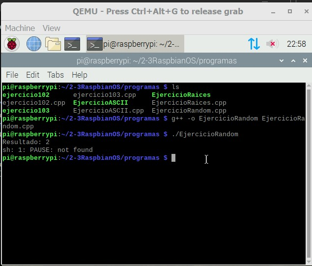

#    Tecnológico Nacional de México
#   Instituto Tecnológico de Tijuana
#        Subdirección Académica

# Departamento de Sistemas y Computación
# Ingeniería en Sistemas Computacionales
# Lenguajes de interfaz 

# Practica Bloque: 2.3  (REPOST) Elabora la QEMU de RaspberryPI virtual y corra sus programas de CPP.

# Villalobos Becerril Oliver
# No.Control: 18212282
   
# Profesor:
# MC. René Solis Reyes
# Semestre sep - ene 2020


__Aquí se ingresa a la carpeta donde se encuentra el archivo run_raspbian.bat .__



__Al entrar te aparecera la siguiente pantalla de carga.__



__Esta es la pantalla principal donde tendremos que localizar el icono de la terminal.__




__Al estar dentro de la terminal, se procede a clonar el repositorio donde se ubican los programas cpp.__




```bash 

// EjerciciosLenguajesInterfaz1
/*
INSTITUTO TECNOLOGICO DE TIJUANA
OLIVER VILLALOBOS BECERRIL
NO.CONTROL: 18212282
*/

//Maestro no pude hacer el 101,104, 105 por lo que use uno con random, formulas matematicas y uno muy curioso que te transforma a ascii.
//Ejercicio 102
//Programa en el que te de el cociente y el residuo

#include <iostream>
using namespace std;

int main() {
    int numero = 0, divisor = 0, cociente = 0, residuo = 0;

    cout<<"Introduce un numero entero a dividir: \n";
    cin>>numero;
    cout<<"Introduce un divisor entero: \n";
    cin>>divisor;

    cociente = numero/divisor;
    residuo = numero%divisor;

    cout<<"El cociente de la division "<<numero<<" / "<<divisor<<" es igual a "<<cociente<<"\n";
    cout<<"El residuo de la division "<<numero<<" / "<<divisor<<" es igual a "<<residuo<<"\n";

    return 0;
}

```




```bash

// EjerciciosLenguajesInterfaz1
/*
INSTITUTO TECNOLOGICO DE TIJUANA
OLIVER VILLALOBOS BECERRIL
NO.CONTROL: 18212282
*/
//Ejercicio 103
//Un programa que te diga la determinante de una matriz

#include <iostream>
#include <cmath>
#define MAX 5

using namespace std;

void mostrar_matriz(int matriz[][MAX], int orden);
int determinante(int matriz[][MAX], int orden);
int cofactor(int matriz[][MAX], int orden, int fila, int columna);

int main()
{
   int matriz[MAX][MAX];
   int orden;
   
   cout << "Ingresa el orden de la matriz (maximo " << MAX << "): ";
   cin >> orden;
   while (orden < 0 || orden > MAX) {
      cout << "\nEl orden de la matriz no puede ser mayor que " << MAX << endl;
      cout << "Ingrese nuevamente el orden de la matriz: ";
      cin >> orden;
   }
   
   cout << "\nIngrese los elementos de la matriz:\n\n";
   for (int i = 0; i < orden; i++) {
      for (int j = 0; j < orden; j++) {
         cin >> matriz[i][j];
      }
   }

   cout << "\nMostrando la matriz ingresada:\n";
   mostrar_matriz(matriz, orden);
   
   cout << "\nEl determinante es: " << determinante(matriz, orden) << endl;

   cin.get();
   cin.get();
   return 0;
}

void mostrar_matriz(int matriz[][MAX], int orden)
{
   cout << "Orden: " << orden << endl;
   for (int i = 0; i < orden; i++) {
      for (int j = 0; j < orden; j++) {
         cout << "\t" << matriz[i][j];
      }
      cout << "\n";
   }
}


int determinante(int matriz[][MAX], int orden)
{
   int det = 0.0;
   
   if (orden == 1) {
      det = matriz[0][0];
   } else {
      for (int j = 0; j < orden; j++) {
         det = det + matriz[0][j] * cofactor(matriz, orden, 0, j);
      }
   }
   
   return det;
}


int cofactor(int matriz[][MAX], int orden, int fila, int columna)
{
   int submatriz[MAX][MAX];
   int n = orden - 1;
   
   int x = 0;
   int y = 0;
   for (int i = 0; i < orden; i++) {
      for (int j = 0; j < orden; j++) {
         if (i != fila && j != columna) {
            submatriz[x][y] = matriz[i][j];
            y++;
            if (y >= n) {
               x++;
               y = 0;
            }
         }
      }
   }
   
   return pow(-1.0, fila + columna) * determinante(submatriz, n);
}

```




```bash

// EjerciciosLenguajesInterfaz1
/*
INSTITUTO TECNOLOGICO DE TIJUANA
OLIVER VILLALOBOS BECERRIL
NO.CONTROL: 18212282
*/

//Convertidor de caracteres a ASCII
#include <iostream>
using namespace std;

int main()
{
	char c;
	cout << "Ingrese un caracter: ";
	cin >> c;
	cout << "El valor ASCII de  " << c << " es " << int(c);
	return 0;
}

```




```bash

// EjerciciosLenguajesInterfaz1
/*
INSTITUTO TECNOLOGICO DE TIJUANA
OLIVER VILLALOBOS BECERRIL
NO.CONTROL: 18212282
*/

//Raices te da las raices a base de la formula general
#include <iostream>
#include <cmath>
using namespace std;

int main() {

    float a, b, c, x1, x2, discriminant, ParteReal, ParteImaginaria;
    cout << "Ingre los valores de a, b y c: ";
    cin >> a >> b >> c;
    discriminant = b * b - 4 * a * c;

    if (discriminant > 0) {
        x1 = (-b + sqrt(discriminant)) / (2 * a);
        x2 = (-b - sqrt(discriminant)) / (2 * a);
        cout << "Las raices son reales y diferentes." << endl;
        cout << "x1 = " << x1 << endl;
        cout << "x2 = " << x2 << endl;
    }

    else if (discriminant == 0) {
        cout << "Raices son iguales y reales." << endl;
        x1 = (-b + sqrt(discriminant)) / (2 * a);
        cout << "x1 = x2 =" << x1 << endl;
    }

    else {
        ParteReal = -b / (2 * a);
        ParteImaginaria = sqrt(-discriminant) / (2 * a);
        cout << "Raices son complejas y diferentes." << endl;
        cout << "x1 = " << ParteReal << "+" << ParteImaginaria << "i" << endl;
        cout << "x2 = " << ParteReal << "-" << ParteImaginaria << "i" << endl;
    }

    return 0;
}

```




```bash

// EjerciciosLenguajesInterfaz1
/*
INSTITUTO TECNOLOGICO DE TIJUANA
OLIVER VILLALOBOS BECERRIL
NO.CONTROL: 18212282
*/

//Dado Juego
//
//  Un programa que te de numeros aleatorios del 1 al 6 como en un dado
//  1 es perdiste, 6 es ganaste, y lo que no sea ni 1 ni 6 no es nada
#include <iostream>
#include <string>
#include <ctime>
using namespace std;
int main(){
    srand(time(NULL));
    int number = 6;
    int res = 0;
    res = rand() % number + 1;

    switch (res)
    {
        case 1:
            cout << "PERDISTE" <<endl;
            break;
        case 6:
            cout << "GANASTE" <<endl;
            break;
        default:
            break;
    }

    cout << "Resultado: " << res << endl;

    system("PAUSE");

    return 0;
}

```




## Es importante compilar cualquier programa en c++ que se tenga en linux, ya que este nos indicara si funcionan correctamente, de igual manera esta practica ayuda para familiarizarse con el sistema operativo RaspbianOS y reforzar los conocimientos adquiridos en la certificacion del curso de C++ otorgada por SoloLearn. 

<a href="http://cooltext.com" target="_top"></a>
